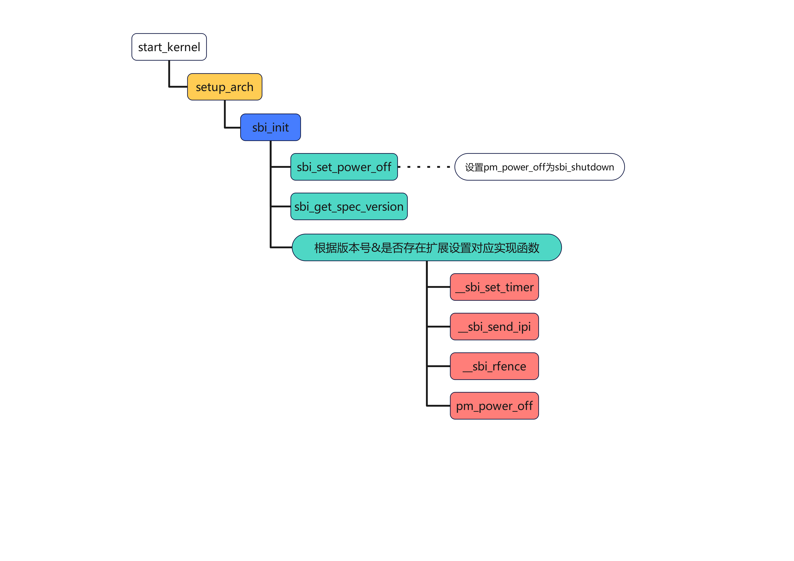
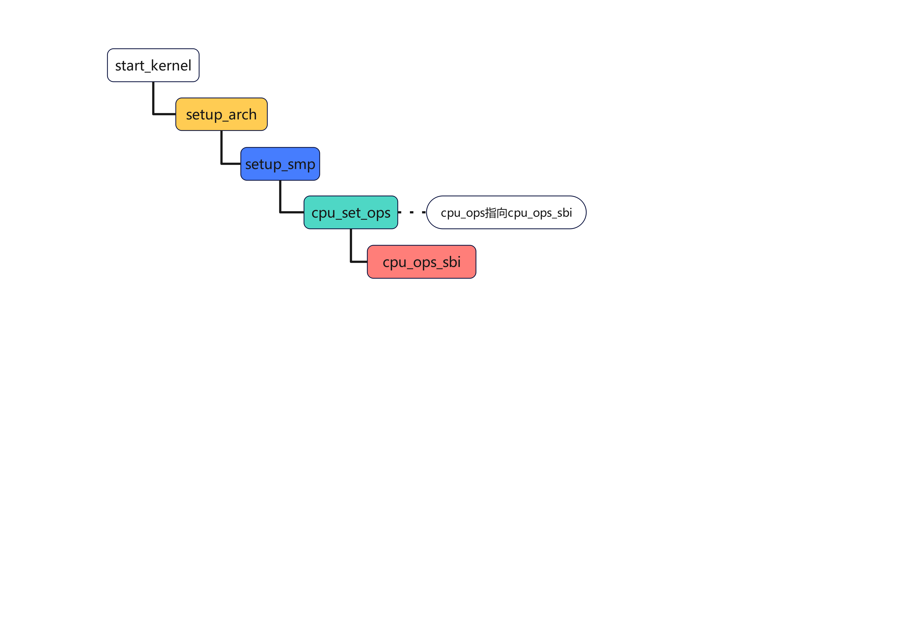

Linux通过ecall进行SBI调用，让CPU核进入M-Mode进行处理。

Linux中SBI的应用需要满足3个需求：
- 支持SBI v0.1规格。
- 支持Timer、IPI、RFence等。
- 支持扩展的HSM，对CPU进行Start/Stop。


# sbi初始化
文件路径：</br>
>cgel/riscv/os/CGEL_RISCV_1.1.0/kernel-source/arch/riscv/kernel/setup.c</br>
>cgel/riscv/os/CGEL_RISCV_1.1.0/kernel-source/arch/riscv/kernel/sbi.c</br>
>cgel/riscv/os/CGEL_RISCV_1.1.0/kernel-source/arch/riscv/include/asm/sbi.h</br>



如果sbi版本号高于0.1，且有对应功能的需求扩展，则设置Timer/IPI/Rfence等0.2版本有具体实现的函数指针；否则设置为0.1版本的空函数指针。

# sbi调用
Linux通过sbi_ecall()调用sbi的功能，sbi_ecall()通过ecall指令进入M-mode出发ecall异常。

参数：
- a0-a5一共6个参数
- a6作为function id
- a7作为extension id

返回值：
- a0为sbiret.error
- a1为sbiret.value

函数实现如下：
```
// cgel/riscv/os/CGEL_RISCV_1.1.0/kernel-source/arch/riscv/kernel/sbi.c
struct sbiret sbi_ecall(int ext, int fid, unsigned long arg0,
            unsigned long arg1, unsigned long arg2,
            unsigned long arg3, unsigned long arg4,
            unsigned long arg5)
{
    struct sbiret ret;

    register uintptr_t a0 asm ("a0") = (uintptr_t)(arg0);
    register uintptr_t a1 asm ("a1") = (uintptr_t)(arg1);
    register uintptr_t a2 asm ("a2") = (uintptr_t)(arg2);
    register uintptr_t a3 asm ("a3") = (uintptr_t)(arg3);
    register uintptr_t a4 asm ("a4") = (uintptr_t)(arg4);
    register uintptr_t a5 asm ("a5") = (uintptr_t)(arg5);
    register uintptr_t a6 asm ("a6") = (uintptr_t)(fid);
    register uintptr_t a7 asm ("a7") = (uintptr_t)(ext);
    asm volatile ("ecall"
              : "+r" (a0), "+r" (a1)
              : "r" (a2), "r" (a3), "r" (a4), "r" (a5), "r" (a6), "r" (a7)
              : "memory");
    ret.error = a0;
    ret.value = a1;

    return ret;
}
```

Linux的SBI Extension id需要和OpenSBI中的匹配，对应的可以查看04 OpenSBI trap相关内容：
```
// cgel/riscv/os/CGEL_RISCV_1.1.0/kernel-source/arch/riscv/include/asm/sbi.h
enum sbi_ext_id {
#ifdef CONFIG_RISCV_SBI_V01
    SBI_EXT_0_1_SET_TIMER = 0x0,
    SBI_EXT_0_1_CONSOLE_PUTCHAR = 0x1,
    SBI_EXT_0_1_CONSOLE_GETCHAR = 0x2,
    SBI_EXT_0_1_CLEAR_IPI = 0x3,
    SBI_EXT_0_1_SEND_IPI = 0x4,
    SBI_EXT_0_1_REMOTE_FENCE_I = 0x5,
    SBI_EXT_0_1_REMOTE_SFENCE_VMA = 0x6,
    SBI_EXT_0_1_REMOTE_SFENCE_VMA_ASID = 0x7,
    SBI_EXT_0_1_SHUTDOWN = 0x8,
#endif
    SBI_EXT_BASE = 0x10,
    SBI_EXT_TIME = 0x54494D45,
    SBI_EXT_IPI = 0x735049,
    SBI_EXT_RFENCE = 0x52464E43,
    SBI_EXT_HSM = 0x48534D,
};
```
# cpu_ops设置
如果定义了CONFIG_RISCV_SBI，那么cpu_ops会通过SBI进行处理。

相关文件：
>cgel/riscv/os/CGEL_RISCV_1.1.0/kernel-source/arch/riscv/kernel/smpboot.c</br>
>cgel/riscv/os/CGEL_RISCV_1.1.0/kernel-source/arch/riscv/kernel/cpu_ops.c</br>



cpu_ops_sbi函数通过sbi实现其功能，主要包括：
- SBI_EXT_HSM_HART_START
- SBI_EXT_HSM_HART_STOP
- SBI_EXT_HSM_HART_STATUS

实现如下：
```
// cgel/riscv/os/CGEL_RISCV_1.1.0/kernel-source/arch/riscv/kernel/cpu_ops_sbi.c
const struct cpu_operations cpu_ops_sbi = {
    .name        = "sbi",
    .cpu_prepare    = sbi_cpu_prepare,
    .cpu_start    = sbi_cpu_start,
#ifdef CONFIG_HOTPLUG_CPU
    .cpu_disable    = sbi_cpu_disable,
    .cpu_stop    = sbi_cpu_stop,
    .cpu_is_stopped    = sbi_cpu_is_stopped,
#endif
};
```
