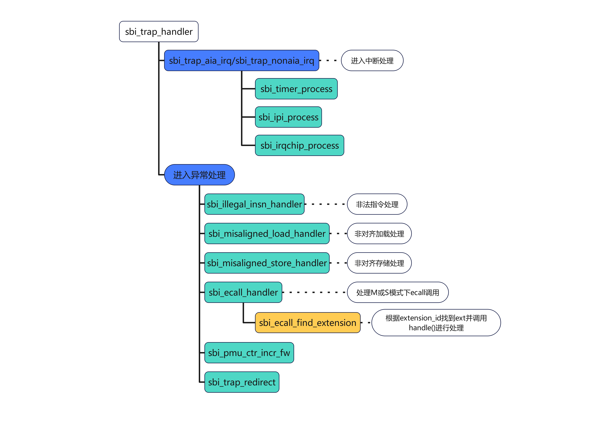

在__start_warm()中将_trap_handler()设置给CSR_MTVEC。

_trap_handler()根据异常来分别进行处理：
- M-Mode调用_trap_handler_m_mode()；
- S-Mode/U-Mode调用_trap_handler_s_mode()。

无论是M-Mode还是S-Mode/U-Mode都会经过_trap_handler_all_mode()处理，主要是上下文保存，然后调用C函数sbi_trap_handler()进行处理，再恢复上下文，最后调用mret异常处理结束返回。


大致流程如下：
```
_trap_handler:
    TRAP_SAVE_AND_SETUP_SP_T0
    TRAP_SAVE_MEPC_MSTATUS 0              // 保存CSR_MEPC和CSR_MSTATUS寄存器。
    TRAP_SAVE_GENERAL_REGS_EXCEPT_SP_T0   // 保存SP和T0之外的通用寄存器。
    TRAP_CALL_C_ROUTINE                   // 调用sbi_trap_handler()函数。
_trap_exit:
    TRAP_RESTORE_GENERAL_REGS_EXCEPT_A0_T0
    TRAP_RESTORE_MEPC_MSTATUS 0
    TRAP_RESTORE_A0_T0
    mret
```

# RISC-V异常状态说明
MCAUSE是机器模式异常事件向量寄存器，用于保存触发异常的异常事件向量号，用于在异常服务程序中处理对应事件。最高位是中断标记位。

为1是表示异常的来源是中断：
```
#define IRQ_S_SOFT            1
#define IRQ_VS_SOFT            2
#define IRQ_M_SOFT            3
#define IRQ_S_TIMER            5
#define IRQ_VS_TIMER            6
#define IRQ_M_TIMER            7
#define IRQ_S_EXT            9
#define IRQ_VS_EXT            10
#define IRQ_M_EXT            11
#define IRQ_S_GEXT            12
#define IRQ_PMU_OVF            13
```
为0时，表示异常来源不是中断，Exception Code按照异常解析：
```
#define CAUSE_MISALIGNED_FETCH            0x0        // 指令地址未对齐（例如PC指向非2/4字节对齐地址）
#define CAUSE_FETCH_ACCESS                0x1        // 指令访问错误（如非法地址访问）
#define CAUSE_ILLEGAL_INSTRUCTION         0x2        // 非法指令（解码失败的指令）
#define CAUSE_BREAKPOINT                  0x3        // 调试断点
#define CAUSE_MISALIGNED_LOAD             0x4        // 加载数据地址未对齐（如非对齐的LW指令）
#define CAUSE_LOAD_ACCESS                 0x5        // 加载访问错误（如权限不足或地址无效）
#define CAUSE_MISALIGNED_STORE            0x6        // 存储地址未对齐（如非对齐的SW指令）
#define CAUSE_STORE_ACCESS                0x7        // 存储访问错误（如权限不足或地址无效）
#define CAUSE_USER_ECALL                  0x8        // 用户模式下的 ecall（系统调用）
#define CAUSE_SUPERVISOR_ECALL            0x9        // 监督模式下的 ecall
#define CAUSE_VIRTUAL_SUPERVISOR_ECALL    0xa        // 虚拟监督模式下的ecall
#define CAUSE_MACHINE_ECALL               0xb        // 机器模式下的 ecall
#define CAUSE_FETCH_PAGE_FAULT            0xc        // 指令获取时发生页错误
#define CAUSE_LOAD_PAGE_FAULT             0xd        // 加载时发生页错误
#define CAUSE_STORE_PAGE_FAULT            0xf        // 存储时发生页错误
#define CAUSE_FETCH_GUEST_PAGE_FAULT      0x14       // 在虚拟机（Guest）尝试取指（执行指令）时，发生了页错误，并且该页错误是发生在 G-stage（Guest Stage）页表转换过程中
#define CAUSE_LOAD_GUEST_PAGE_FAULT       0x15       // G-stage 页表转换时发生加载页错误
#define CAUSE_VIRTUAL_INST_FAULT          0x16       // 虚拟指令访问异常
#define CAUSE_STORE_GUEST_PAGE_FAULT      0x17       // G-stage 页表转换时发生存储页错误
```

sbi_trap_handler()是Trap处理的C入口函数，进行送到M-Mode的中断和异常处理。大致流程如下：



# ecall相关说明
在文件opensbi/lib/sbi/sbi_ecall.c中，有如下几个关键函数：
```
// 创建静态ecall类型链表
static SBI_LIST_HEAD(ecall_exts_list);

// 根据入参的标号寻找对应的调用类型
struct sbi_ecall_extension *sbi_ecall_find_extension(unsigned long extid);

// 注册一个新的类型的ecall调用
int sbi_ecall_register_extension(struct sbi_ecall_extension *ext);

// 移除一个类型ecall调用
void sbi_ecall_unregister_extension(struct sbi_ecall_extension *ext);

// ecall调用入口函数
int sbi_ecall_handler(struct sbi_trap_regs *regs);

// 初始化预设类型的ecall调用，将其加入链表中
int sbi_ecall_init(void);
```

# ecall种类
ecall在大类上可以分为如下几个：
```
SBI_EXT_0_1_SET_TIMER			
SBI_EXT_0_1_CONSOLE_PUTCHAR		
SBI_EXT_0_1_CONSOLE_GETCHAR		
SBI_EXT_0_1_CLEAR_IPI                       // 清除发送给指定 hart 的所有 IPI
SBI_EXT_0_1_SEND_IPI                        // 向指定 hart 发送 IPI
SBI_EXT_0_1_REMOTE_FENCE_I
SBI_EXT_0_1_REMOTE_SFENCE_VMA
SBI_EXT_0_1_REMOTE_SFENCE_VMA_ASID          // 
SBI_EXT_0_1_SHUTDOWN
SBI_EXT_BASE	
SBI_EXT_TIME	
SBI_EXT_IPI		
SBI_EXT_RFENCE	
SBI_EXT_HSM		
SBI_EXT_SRST	
SBI_EXT_PMU	
```

## 1. ecall_time
```
struct sbi_ecall_extension ecall_time = {
    .extid_start = SBI_EXT_TIME,
    .extid_end = SBI_EXT_TIME,
    .handle = sbi_ecall_time_handler,
};

// 包含类型
SBI_EXT_TIME_SET_TIMER                     // 设置定时器
```

## 2. ecall_rfence
```
// 远程fence操作扩展
struct sbi_ecall_extension ecall_rfence = {
    .extid_start = SBI_EXT_RFENCE,
    .extid_end = SBI_EXT_RFENCE,
    .handle = sbi_ecall_rfence_handler,
};

// 包含如下类型
SBI_EXT_RFENCE_REMOTE_FENCE_I               // 在远程其他hart上执行FENCH.I（指令同步指令， 用于刷新指令缓存I-cach）指令
SBI_EXT_RFENCE_REMOTE_SFENCE_VMA            // 远程执行SFENCE.VMA（刷新TLB）
SBI_EXT_RFENCE_REMOTE_SFENCE_VMA_ASID       // 远程执行SFENCE.VMA + ASID
SBI_EXT_RFENCE_REMOTE_HFENCE_GVMA_VMID      // 远程执行 HFENCE.GVMA + VMID
SBI_EXT_RFENCE_REMOTE_HFENCE_GVMA           // 远程执行HFENCE.GVMA（虚拟化TLB）
SBI_EXT_RFENCE_REMOTE_HFENCE_VVMA_ASID      // 远程执行 HFENCE.VVMA + ASID
SBI_EXT_RFENCE_REMOTE_HFENCE_VVMA           // 远程执行 HFENCE.VVMA
```

## 3. ecall_ipi
```
// 向其他hart发送IPI（Inter-Processor Interrupt，处理器间中断）扩展
struct sbi_ecall_extension ecall_ipi = {
    .extid_start = SBI_EXT_IPI,
    .extid_end = SBI_EXT_IPI,
    .handle = sbi_ecall_ipi_handler,
};

// 包含类型
SBI_EXT_IPI_SEND_IPI                       // 向指定 hart 发送 IPI
SBI_EXT_IPI_SEND_PLIC                      // 用于某些 不支持IPI的CLINT，而采用PLIC的 IPI发送
```

## 4. ecall_base
```
// 基础功能扩展
struct sbi_ecall_extension ecall_base = {
    .extid_start = SBI_EXT_BASE,
    .extid_end = SBI_EXT_BASE,
    .handle = sbi_ecall_base_handler,
};

// 包含类型
SBI_EXT_BASE_GET_SPEC_VERSION              // 获取 SBI 规范版本
SBI_EXT_BASE_GET_IMP_ID                    // 获取当前使用厂商的ID
SBI_EXT_BASE_GET_IMP_VERSION               // 获取当前厂商版本
SBI_EXT_BASE_PROBE_EXT                     // 探测某个扩展是否被支持
SBI_EXT_BASE_GET_MVENDORID                 // 获取 mvendorid（仅在 SBI spec ≥ 0.3 时可用）
SBI_EXT_BASE_GET_MARCHID                   // 获取 marchid
SBI_EXT_BASE_GET_MIMPID                    //获取 mimpid
```

## 5. ecall_hsm
```
// HSM（Hart State Management）扩展
struct sbi_ecall_extension ecall_hsm = {
    .extid_start = SBI_EXT_HSM,
    .extid_end = SBI_EXT_HSM,
    .handle = sbi_ecall_hsm_handler,
};

// 包含类型
SBI_EXT_HSM_HART_START		           // 启动一个hart
SBI_EXT_HSM_HART_STOP		           // 停止一个hart
SBI_EXT_HSM_HART_GET_STATUS	           // 获取一个hart状态
SBI_EXT_HSM_HART_SUSPEND	           // 挂起一个hart
```

## 6. ecall_srst
```
// 系统重启(System reset)扩展
struct sbi_ecall_extension ecall_srst = {
    .extid_start = SBI_EXT_SRST,
    .extid_end = SBI_EXT_SRST,
    .handle = sbi_ecall_srst_handler,
    .probe = sbi_ecall_srst_probe,
};

// 包含类型
SBI_EXT_SRST_RESET                         // 请求系统或hart重启
```

## 7. ecall_pmu
```
// PMU（Performance Monitoring Unit）扩展 
struct sbi_ecall_extension ecall_pmu = {
    .extid_start = SBI_EXT_PMU,
    .extid_end = SBI_EXT_PMU,
    .handle = sbi_ecall_pmu_handler,
    .probe = sbi_ecall_pmu_probe,
};

// 包含类型
SBI_EXT_PMU_NUM_COUNTERS                   // 获取系统支持的计数器数量
SBI_EXT_PMU_COUNTER_GET_INFO               // 获取计数器信息（类型、宽度、支持的事件）
SBI_EXT_PMU_COUNTER_CFG_MATCH              // 配置匹配模式和中断触发
SBI_EXT_PMU_COUNTER_START                  // 启动计数器
SBI_EXT_PMU_COUNTER_STOP                   // 停止计数器
SBI_EXT_PMU_COUNTER_FW_READ                // 通过 firmware 读取计数器的当前值
```

## 8. ecall_legacy
```
struct sbi_ecall_extension ecall_legacy = {
    .extid_start = SBI_EXT_0_1_SET_TIMER,
    .extid_end = SBI_EXT_0_1_SHUTDOWN,
    .handle = sbi_ecall_legacy_handler,
};
```

## 9. ecall_vendor
```
struct sbi_ecall_extension ecall_vendor = {
    .extid_start = SBI_EXT_VENDOR_START,
    .extid_end = SBI_EXT_VENDOR_END,
    .probe = sbi_ecall_vendor_probe,
    .handle = sbi_ecall_vendor_handler,
};
```
