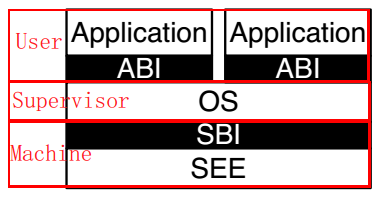
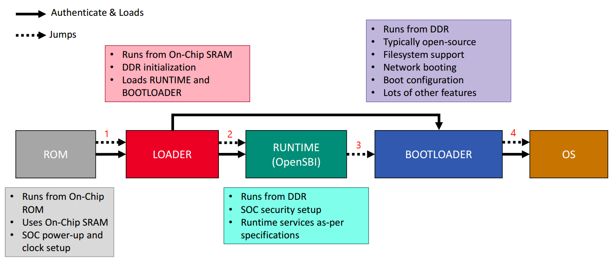
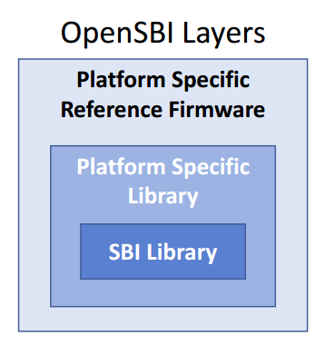
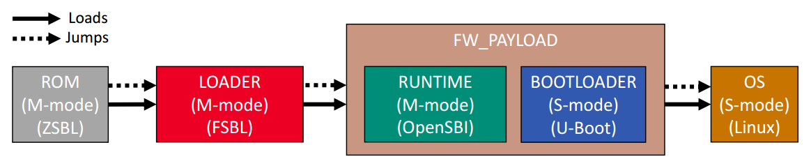
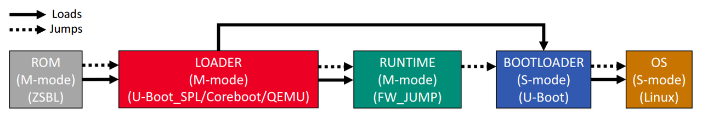
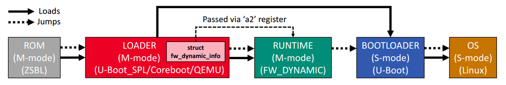

# 1. RISCV工作模式
RISC-V Core支持三种Mode：User Mode、Supervisor Mode、Machine Mode。

用户模式:运行用户程序的模式，权限级别最低。不能直接访问I/O或特权指令或内核内存或其他进程。 
特权模式:大多数Linux内核或其他O/S运行的模式。通过I/O remap函数访问最特权的指令和I/O控制。内存管理单元可能打开或关闭。 
机器模式:裸机程序/第一阶段引导加载程序和BBL在此模式下运行。BBL以固件的形式存在 

**某一时刻HART仅运行在一种Mode**。

# 2. SBI的定义与作用
SBI指的是RISC-V Supervisor Binary Interface。 
SEE指的是Supervisor Execution Environment。 
SBI是类系统调用的Supervisor和SEE之间的调用转换。

> SBI的作用： 
> 提高不同OS之间的代码复用。 
> 提供不同平台共用的OS通用驱动。 
> 提供直接访问M模式下专有资源接口。

# 3. RISCV启动流程
典型的RISC-V启动流程如下，以Loader为spl、Bootloader为U-Boot、OS为Linux为例。
1. 系统POR之后，从ROM开始启动。将SPL加载到SRAM中。跳转到SPL运行。
2. SPL进行DDR初始化，并将OpenSBI和U-Boot加载到DDR中。跳转到OpenSBI中运行。
3. OpenSBI从DDR中开始执行，进行相关设置。跳转到U-Boot中执行。
4. U-Boot加载Linux到DDR中，进行解析、解压等操作。最后跳转到Linux中运行。
5. 最后处于运行态的仅有OpenSBI和Linux，Linux通过sbi指令和OpenSBI进行交互。

# 4. RISCV固件组成
SBI Library：通用功能抽象。 
Platform Specific Library：某些平台特有的功能。 
固件：提供三种不同类型的Runtime固件，包括Payload、Dynamic、Jump。

# 5. OpenSBI固件形态
固件的三种形态：

FW_PAYLOAD：OpenSBI和下一级启动固件绑定在一起。 
缺点：
- 任何OpenSBI或者Bootloader改变，都需要重新编译。
- 无法从前一bootloader传递参数到FW_PAYLOAD。

FW_JUMP：跳转到一个固定的地址执行下一个固件。 
优点：对于QEMU需要使用预编译的FW_JUMP很有用，不需要传递参数。 
缺点：
- 前一bootload必须将下一boot镜像加载到固定地址。
- 没有传递参数的机会。

FW_DYNAMIC：跳转的时候传递参数个下一个固件。 
优点：下一Bootloader不需要记载到指定地点。 
缺点：前一bootloader必须传递号struct fw_dynamic_info参数。 

